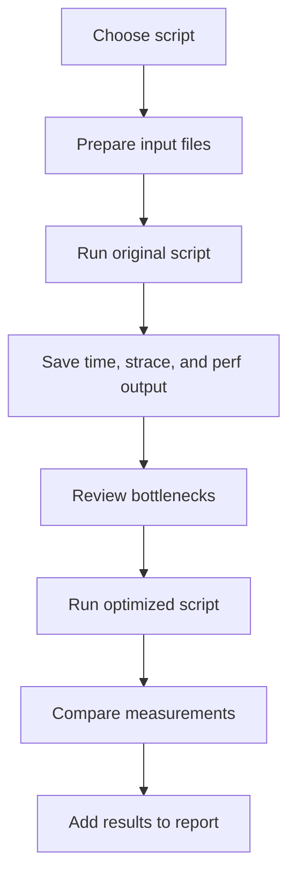
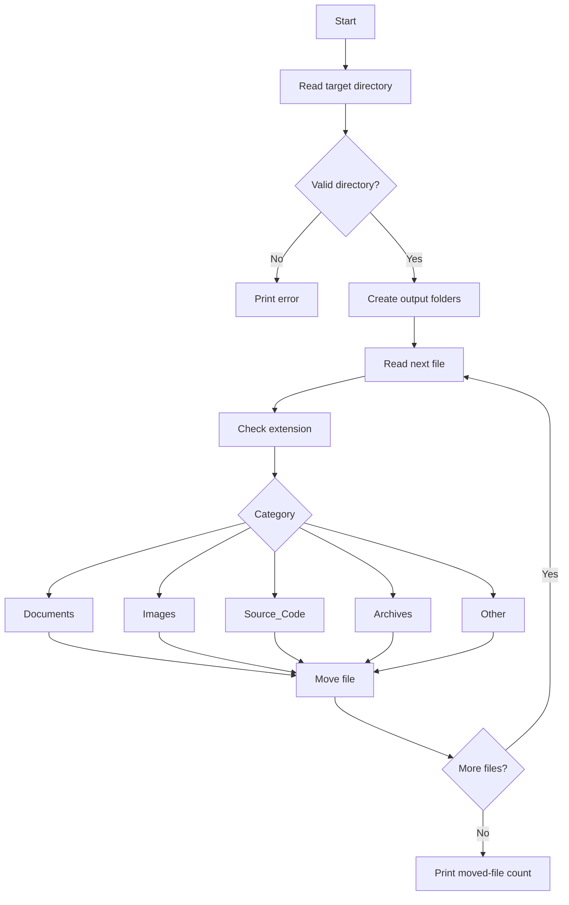

# Diagrams

This folder contains Mermaid flowcharts for Paper 1.

## Script Diagrams

- `blank-rename.mmd`
- `collatz.mmd`
- `days-between.mmd`
- `encryptedpw.mmd`
- `life.mmd`
- `mailformat.mmd`
- `makedict.mmd`
- `password.mmd`
- `rn.mmd`
- `soundex.mmd`

## Benchmark Workflow

## File Organizer Logic

